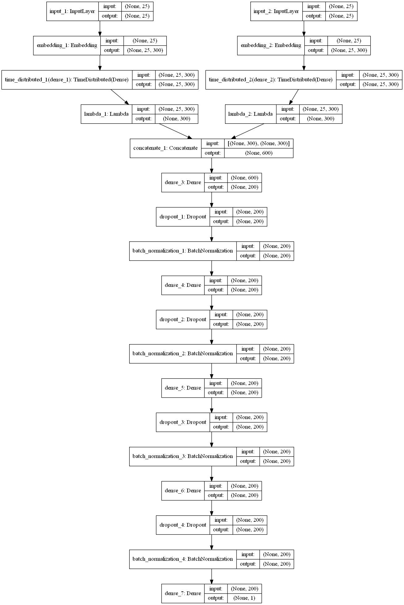

# Quora Question Pairs

## Background

Online forums and discussion boards, like Quora, receive thousands of questions every day from millions of users around the globe. Each of these questions can be categorised under some topics, as specified by the user or as classified by algorithms. However, this brings out redundancy in the queries, frequently in cases for the most trending topics or discussions from a time. Various requests with the same meaning can cause users to spend more time finding the best answer to their question and make writers feel they need to answer multiple versions of the same question. To tackle this problem, an autonomous system must be developed that will identify question pairs that have similar intent and cluster them into sets from the same subject or mark them as duplicate questions, thus improving overall querying time and reducing the need to write redundant answers.

## Our Understanding

The dataset consists of a training data file and a test data file. The training file consists of list of question pairs in the form of ‘question1’ = [Q1, Q2, Q3…] and ‘question2’ = [Q1, Q2, Q3…] with their respective ids as ‘qid1’ = [Qid1, Qid3, Qid5…] and ‘qid2’ = [Qid2, Qid4, Qid6…] and a separate column with a binary training label for each pair as ‘is_duplicate’ = [0, 0…1, 0, 1…]. Similarly, the testing file also consists of question pairs against which the trained model will be verified. The ground truth is the set of labels that have been supplied by human experts. Thus, they are subjective, since every question can be interpreted by each user in a different way.

## Scope

This documentation contains explanation of our approach to the problem at hands and certain metrics with which we evaluate our model. We also describe the dataset and how we tune, denoise, extract and manipulate our data to better learn the feature represented by them. We talk about GloVe and word embeddings and how we use them to train our model.

## Out of Scope

We will not be discussing the Word2Vec models and LSTMs as we have used pre-defined models to aid us in this project, thus reducing overall training time and improving performance. 

## Assumptions

1. We have assumed that the sentences maybe grammatically incorrect whereby sometimes changing the technical meaning of the underlying intent. Features didn’t need to be hand-tuned as neural networks can extract relevant features from the given set of data. 
2. We also assumed that the data may have corrupted values(float values or NaN) which may cause problems while extracting features.
3. We also assume that due to limited hardware resources, our project may take a longer time to train over the dataset and we may need to process over small batches of data to prevent running out of resources.

## Solution Approach

We approach the solution from the perspective of neural networks. They are machine learning algorithms that generalize better. More specifically Recurrent Neural Networks(RNNs) with Long Short Term Memory(LSTM) cells. We feed the two sentences at the beginning of the network simultaneously through two different LSTM layers and then merge them after their word vectors have been formed. Then we apply a semantic analysis on the vectors to find the probability of them being the same. This is the Manhattan LSTM architecture proposed by Mueller and Thyagarajan[1]. 

## Technical Architecture

We use the architecture proposed by Mueller and Thyagarajan called Manhattan LSTMs[1]. But instead of building the model from scratch we used a few pre-built models. Normally we use LSTMs to construct Word2Vec models to generalize our word embeddings during training and optimize our hyperparameters. We chose a prebuilt word vector vocabulary to reduce our training time and improve overall accuracy.

We used the Stanford Natural Language Inference (SNLI) benchmark model[2], using a simple summation of GloVe word embeddings [3] to represent each question in the pair. We use binary cross-entropy as a loss function, Adam for optimization and accuracy as a metric.

1. As opposed to the proposed model, we used the maximum of vectors approach in order to calculate the word vectors instead of calculating the sum of the values.
2. This reduced the need for bidirectional LSTMs or GRU recurrent layers, as was proposed.
3. Embedding layer prepares the word vector embedding using the pre-trained GloVe model and due the padding used during the pre-processing of data, consistency is maintained.
4. A TimeDistributed Dense layer was used for each sentence to every temporal slice of the input, along with a Lambda wrapper to specify output as a Keras Layer object.
5. Dropouts were added in order to reduce overfitting, and improve accuracy.
6. Batch normalization helps in faster learning and higher overall accuracy.
7. Four hidden Dense layers resulted in the best possible accuracy score as proposed.
8. The final layer is a Dense layer using a ‘sigmoid’ activation function. This is to facilitate accurate probability prediction values in the testing set.

The diagram below represents our model’s architecture along with tensor dimensions:

## Implementation Framework

We used Keras wrapper on Tensorflow framework for this project. Keras is a high level wrapper and is very easy to use. We used nVidia GTX 1060 GPU for faster training and trained our network with 32 batches for 100 epochs, with a training set accuracy of 96.16%.

## References

- Jonas Mueller and Aditya Thyagarajan: Siamese Recurrent Architecture for Learning Sentence Similarity (link).
- Samuel R. Bowman, Gabor Angeli, Christopher Potts, Christopher D. Manning: A large annotated corpus for learning natural language inference (link).
- Jeffrey Pennington, Richard Socher, Christopher D. Manning: GloVe, Global Vectors for Word Representation (link).
